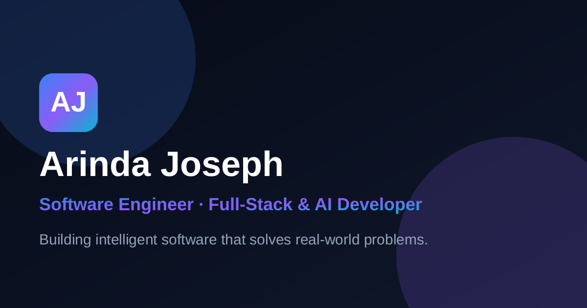

# Arinda Joseph — Portfolio

A premium, production-ready personal portfolio for **Arinda Joseph** — Software
Engineer, Full-Stack & AI Developer, and UI/UX Designer. Built with the modern
web stack and engineered for performance, accessibility and visual excellence.



## ✨ Features

- **Next.js 14 App Router** with TypeScript and a clean, scalable architecture
- **Dark / light mode** with instant switching and persistence (`next-themes`)
- **Framer Motion** animations throughout (fade, slide, zoom, parallax, floats)
- **Custom animated cursor**, **command palette** (`⌘/Ctrl + K`), scroll progress
  bar, loading screen and back-to-top button
- **Particle constellation** hero background + floating 3D-style shapes
- **Fully responsive**, mobile-first, glassmorphism + gradient design system
- **Accessibility**: semantic HTML, ARIA labels, keyboard nav, reduced-motion
- **SEO**: dynamic metadata, Open Graph, Twitter cards, JSON-LD structured data,
  `sitemap.xml`, `robots.txt`, canonical URLs
- **PWA**: web manifest, installable, offline support via a service worker
- **13 sections**: Home, About, Skills, Projects, Experience, Education,
  Certifications, Achievements, Services, Testimonials, Blog, Gallery, Contact

## 🛠 Tech Stack

| Area        | Tools                                                     |
| ----------- | -------------------------------------------------------- |
| Framework   | Next.js 14 (App Router), React 18, TypeScript            |
| Styling     | Tailwind CSS, `tailwindcss-animate`, CSS variables       |
| Animation   | Framer Motion                                            |
| Icons       | Lucide React, React Icons                                |
| Theming     | next-themes                                              |
| Deployment  | Vercel                                                   |

## 🚀 Getting Started

```bash
# 1. Install dependencies
npm install

# 2. (Optional) configure environment variables
cp .env.example .env.local

# 3. Start the dev server
npm run dev
```

Open [http://localhost:3000](http://localhost:3000) in your browser.

### Available scripts

| Script          | Description                       |
| --------------- | --------------------------------- |
| `npm run dev`   | Start the development server      |
| `npm run build` | Create an optimized production build |
| `npm run start` | Run the production build          |
| `npm run lint`  | Run ESLint                        |

## ⚙️ Configuration

All personal content lives in editable data files — no need to touch components:

```
src/constants/site.ts   # name, role, contact info, social links, nav items
src/data/               # skills, projects, experience, education, blog, etc.
```

### Environment variables

See [`.env.example`](.env.example). All are optional:

| Variable                   | Purpose                                             |
| -------------------------- | --------------------------------------------------- |
| `NEXT_PUBLIC_SITE_URL`     | Canonical site URL for SEO / sitemap                |
| `NEXT_PUBLIC_FORMSPREE_ID` | Formspree form ID to enable a live contact form     |

> The contact form works out of the box in **demo mode** (simulated success).
> To receive real submissions, create a free [Formspree](https://formspree.io)
> form and set `NEXT_PUBLIC_FORMSPREE_ID`.

## 📁 Project Structure

```
src/
├── animations/     # Framer Motion variants
├── app/            # App Router: layout, page, 404, sitemap, robots, manifest
├── components/
│   ├── cards/      # Reusable card components
│   ├── layout/     # Navbar, footer, cursor, command palette, etc.
│   └── ui/         # Buttons, badges, headings, primitives
├── constants/      # Site config & navigation
├── context/        # Theme provider
├── data/           # Content data (skills, projects, blog, ...)
├── hooks/          # Custom React hooks
├── lib/            # Utilities (cn, scroll helpers)
├── sections/       # Page sections (hero, about, projects, ...)
└── types/          # Shared TypeScript types
```

## ☁️ Deployment

This project is optimized for **[Vercel](https://vercel.com)**:

1. Push this repository to GitHub.
2. Import the repo into Vercel.
3. (Optional) add the environment variables from `.env.example`.
4. Deploy — Vercel auto-detects Next.js. No extra configuration needed.

You can also deploy anywhere that supports Node.js:

```bash
npm run build && npm run start
```

## 🎨 Customization

- **Colors / theme**: edit the CSS variables in `src/app/globals.css` and the
  Tailwind theme in `tailwind.config.ts`.
- **Content**: edit files in `src/data/` and `src/constants/site.ts`.
- **CV**: replace `public/arinda-joseph-cv.pdf` with your real résumé.
- **Images / icons**: assets live in `public/` (OG image, favicons, manifest icons).

## 📄 License

Released under the [MIT License](LICENSE).

---

Built with ❤️ using Next.js & Tailwind CSS.
